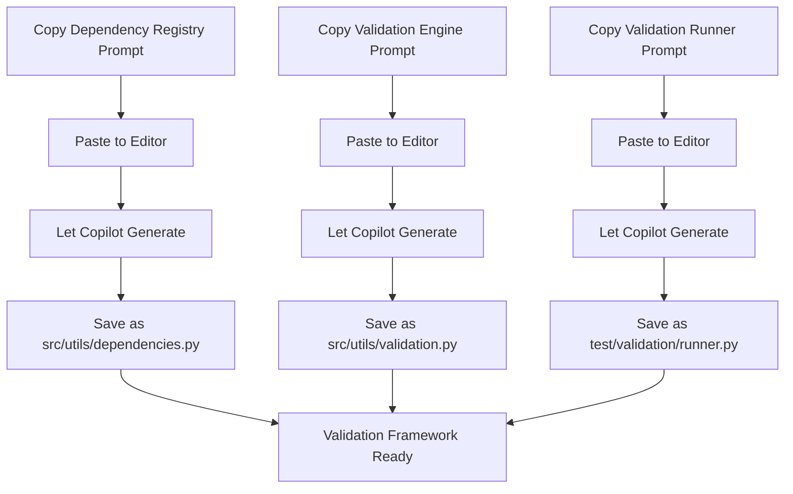

# 📋 Dependency Validation Implementation Guide

## 📊 File Creation Strategy

You don't need to manually create these files yourself. The entire system is designed for **Copilot-driven development**, with all file creation handled through appropriate prompts.

### 🔹 Implementation Workflow

1. **Copilot generates all framework components** based on your prompts
2. You review and save the generated code
3. The validation system becomes operational

## 📌 Specific Prompts for Dependency Validation

Add these template prompts to your collection:

### 1️⃣ Dependency Registry Creation

```
Create a dependency registry module for a Rick Sanchez-themed ZSH assistant with these features:

1. Implement a DEPENDENCY_MAP dictionary that:
   - Maps each component to its dependencies
   - Covers all plugin components in a structured way
   - Organizes dependencies by project phase

2. Add these utility functions:
   - get_dependencies(component): Returns direct dependencies
   - get_dependency_chain(component): Returns the full dependency chain
   - visualize_dependencies(): Generates a dependency graph
   - detect_circular_dependencies(): Identifies circular dependency issues

3. Include these helper utilities:
   - is_component_implemented(component): Checks if component exists
   - get_components_by_phase(phase): Gets all components in a phase
   - sort_components_by_dependency(): Orders components for implementation
   - generate_dependency_documentation(): Creates dependency docs

Use a clear, maintainable structure for the dependency map.
Include docstrings explaining the purpose of each function.
Add comments explaining the dependency relationships.
Make the module importable from other components.
```

### 2️⃣ Validation Engine Implementation
**📄 File**: src/utils/component_validation.py
```
Create a validation engine module for a Rick Sanchez-themed ZSH assistant with these features:

1. Implement these core validation functions:
   - validate_dependency(component, dependency): Verifies component works with dependency
   - validate_dependency_chain(component): Tests complete dependency chain
   - validate_phase(phase_number): Validates all components in a phase
   - validate_all(): Validates the entire plugin

2. Add these execution utilities:
   - import_module_from_path(path): Safely imports module for testing
   - execute_integration_test(component, dependency): Runs explicit integration test
   - generate_validation_report(results): Creates detailed report
   - handle_validation_failure(result): Logs helpful error information

3. Create these reporting functions:
   - format_validation_results(results): Makes results readable
   - log_validation_output(results): Records to validation log
   - console_output(results): Displays terminal-friendly output
   - generate_html_report(results): Creates detailed HTML report

Use clear error messages with Rick's personality for validation failures.
Implement comprehensive exception handling to prevent validation crashes.
Add detailed logging for troubleshooting validation issues.
Make functions robust with specific validation testing approaches.
```

### 3️⃣ Validation Runner Creation
**📄 File**: tests/validation/runner.py
```
Create a validation runner module for a Rick Sanchez-themed ZSH assistant with these features:

1. Implement a command-line interface with these options:
   - --component: Validate a specific component
   - --phase: Validate all components in a phase
   - --all: Validate all components
   - --verbose: Display detailed validation information
   - --report: Generate validation report
   - --fix: Attempt to fix common validation issues

2. Add these execution modes:
   - interactive_mode(): Run validation with user interaction
   - batch_mode(): Run validation without interaction
   - continuous_mode(): Watch for changes and validate
   - pre_commit_mode(): Validate only changed components

3. Create these output formatters:
   - text_output(): Terminal-friendly output
   - json_output(): Structured data for automation
   - html_output(): Detailed visual reports
   - markdown_output(): Documentation generation

4. Implement these utility functions:
   - parse_arguments(): Process command-line arguments
   - detect_modified_components(): Find changed components
   - suggest_resolution(): Recommend fixes for validation issues
   - measure_validation_performance(): Track validation stats

Include Rick-styled output with appropriate personality.
Make the runner executable as a script or module.
Add help text and examples for all command options.
Implement proper exit codes for scripting integration.
```

## 🔹 Integration with Development Workflow

The dependency validation system integrates seamlessly with your development process:

1. **Generate foundation components:**
   - Use prompts to create dependency registry
   - Use prompts to create validation engine
   - Use prompts to create validation runner

2. **Add component-specific validation:**
   - As you implement each component, include its integration test function
   - Generated by Copilot using appropriate templates

3. **Execute validation during development:**
   - After completing components, run validation to verify integration
   - Use validation results to guide further development

## 🔹 Implementation Process



The entire implementation follows the same **copy-paste-generate-save workflow** used for all other components in this Copilot-driven project.