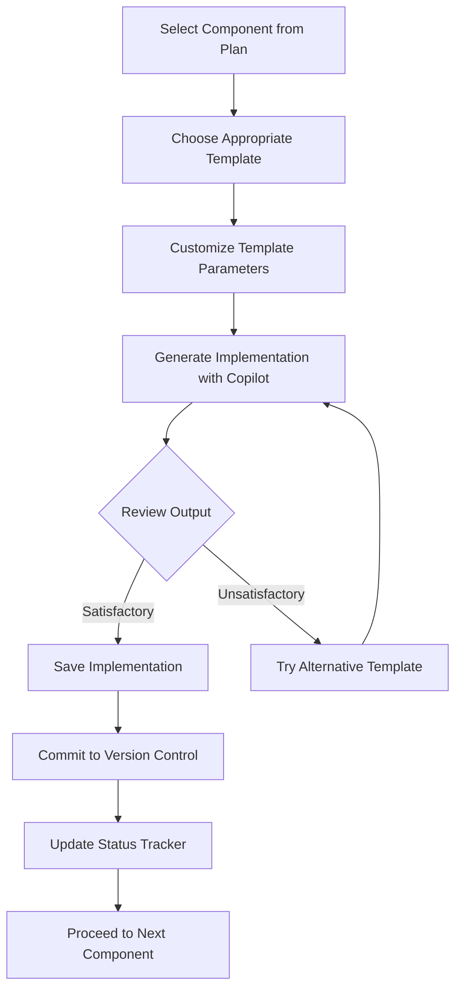

# 🧪 Rick Assistant ZSH Plugin - Implementation Acceleration Framework

## 📊 Development Orchestration Strategy

Comprehensive implementation blueprint across two key artifacts:

1. **Non-Coder Copilot Plan**: Complete component-by-component implementation guide
2. **Prompt Template System**: Flexible template framework for development challenges

### 🔄 Next Steps: Operationalizing Your Development Workflow

---

## 🔹 Environment Preparation & Initialization

### 1️⃣ Development Environment Configuration

```bash
# Create consistent development environment
mkdir -p ~/.rick_assistant_dev
cd ~/.rick_assistant_dev

# Initialize git repository for version tracking
git init
git config user.name "Your Name"
git config user.email "your.email@example.com"

# Create initial commit with project structure
mkdir -p src/{core,ui,ai,utils,config}
mkdir -p tests
touch README.md
git add .
git commit -m "Initialize project structure"
```

### 2️⃣ Implementation Workflow Configuration

- **📌 Establish component tracking system:**
  ```bash
  # Create implementation status tracker
  echo "# Rick Assistant Implementation Status" > implementation_status.md
  echo "" >> implementation_status.md
  echo "## Phase 1: Core Foundation" >> implementation_status.md
  echo "- [ ] 1.1: Main Plugin Entry Point" >> implementation_status.md
  echo "- [ ] 1.2: Logging System" >> implementation_status.md
  # Continue for all components...
  ```

- **📝 Configure version control strategy:**
  ```bash
  # Create branch for each implementation phase
  git branch phase1-core-foundation
  git branch phase2-zsh-integration
  git branch phase3-enhanced-ui
  # Continue for all phases...
  ```

---

## 🔹 Copilot-Assisted Development Workflow

### 1️⃣ Component Implementation Process

Implement each component following this standardized workflow:



### 2️⃣ Progressive Development Strategy

1. **📌 Phase-based implementation tracking**:
   - Complete all Phase 1 components before proceeding
   - Validate phase checkpoint criteria after each phase
   - Maintain component dependency integrity

2. **📝 Implementation productivity optimization**:
   - Batch similar components for implementation efficiency
   - Schedule complex components during peak productivity periods
   - Allocate time buffer for troubleshooting integration issues

---

## 🔹 Quality Assurance Framework

### 1️⃣ Component Validation Process

| Stage | Validation Action | Success Criteria | Failure Mitigation |
|-------|-------------------|------------------|-------------------|
| Initial Generation | Visual review | Matches expected structure | Try alternate template |
| Basic Testing | Execute with test input | Produces expected output | Regenerate with more constraints |
| Integration Testing | Verify interaction with dependencies | Functions without errors | Isolate and regenerate problematic section |
| Performance Assessment | Evaluate execution speed | Completes within acceptable time | Optimize high-latency sections |

### 2️⃣ Systematic Troubleshooting Strategy

When encountering implementation issues:

1. **Isolate problem scope**:
   ```
   # Identify exact component and function causing issues
   # Document specific failure conditions
   ```

2. **Generate focused solution**:
   ```
   # Use Troubleshooting Template targeting specific issue
   # Add constraints based on observed failure
   ```

3. **Validate and integrate fix**:
   ```
   # Test solution in isolation
   # Integrate with broader codebase
   # Verify no regression in related functionality
   ```

---

## 🔹 Implementation Acceleration Techniques

### 1️⃣ Parallel Component Development

For independent components, accelerate development by:

1. **📌 Create implementation batches**:
   ```
   Batch A: logger.py, errors.py, validation.py
   Batch B: config.py, system.py, backup.py
   Batch C: prompt.py, menu.py, status.py
   ```

2. **📝 Generate multiple components sequentially**:
   - Dedicate focused implementation sessions per batch
   - Commit completed components individually
   - Track implementation velocity to optimize batch sizing

### 2️⃣ Template Refinement Strategy

As you progress, enhance template effectiveness by:

1. **Documenting successful patterns**:
   ```markdown
   ## Highly Effective Prompt Patterns
   
   ### Pattern: Explicit Function Signatures
   ```python
   def function_name(param1: type, param2: type) -> return_type:
       """Detailed docstring with parameters and return values"""
   ```
   
   ### Pattern: Explicit Error Handling
   ```python
   try:
       # Operation
   except SpecificError as e:
       # Detailed recovery strategy
   ```
   ```

2. **Creating component-specific template variants**:
   - Refine templates based on component complexity
   - Add successful implementations as examples
   - Adjust detail level based on observed Copilot performance

---

## 🔹 Dependency Validation Framework

### 1️⃣ Inter-component Compatibility Verification

```python
# Dependency Verification Script Template
def verify_dependency(dependent_component, dependency):
    """Verify that dependent_component can function with dependency."""
    try:
        # Import dependency
        # Import dependent_component
        # Execute critical interaction path
        print(f"✅ Dependency verified: {dependent_component} → {dependency}")
        return True
    except Exception as e:
        print(f"❌ Dependency failure: {dependent_component} → {dependency}")
        print(f"Error: {str(e)}")
        return False

# Example verification
verify_dependency("prompt.py", "hooks.py")
```

### 2️⃣ Comprehensive Dependency Chain Validation

After completing each phase, validate the full dependency chain:

```bash
# Execute dependency chain validation
echo "Running Phase 1 dependency validation..."
python -m tests.validate_dependencies --phase=1

# If successful, proceed to next phase
if [ $? -eq 0 ]; then
    echo "✅ Phase 1 dependencies validated successfully"
    echo "Proceeding to Phase 2 implementation"
else
    echo "❌ Phase 1 dependency validation failed"
    echo "Review logs and fix issues before proceeding"
fi
```

---

## 📋 Implementation Command Center

To maintain clear visibility of progress and priorities, create an implementation command center:

```markdown
# 🧪 Rick Assistant Implementation Command Center

## 🚀 Current Implementation Phase: 1 - Core Foundation

### 📈 Progress Tracking
- Overall Progress: 12% (6/50 components)
- Current Phase Progress: 33% (2/6 components)
- Estimated Completion: March 15, 2025

### 🔍 Current Focus Components
1. ⚙️ **IN PROGRESS**: 1.2 Logging System
2. 🔄 **QUEUED**: 1.3 Error Handling System
3. 🔄 **QUEUED**: 1.4 Configuration Management

### 🔎 Recently Completed
1. ✅ 1.1 Main Plugin Entry Point (2025-03-08)

### 🚨 Implementation Blockers
1. None currently

### 📝 Next Actions
1. Complete Logging System implementation
2. Validate logger functionality with simple tests
3. Begin Error Handling System implementation
```
